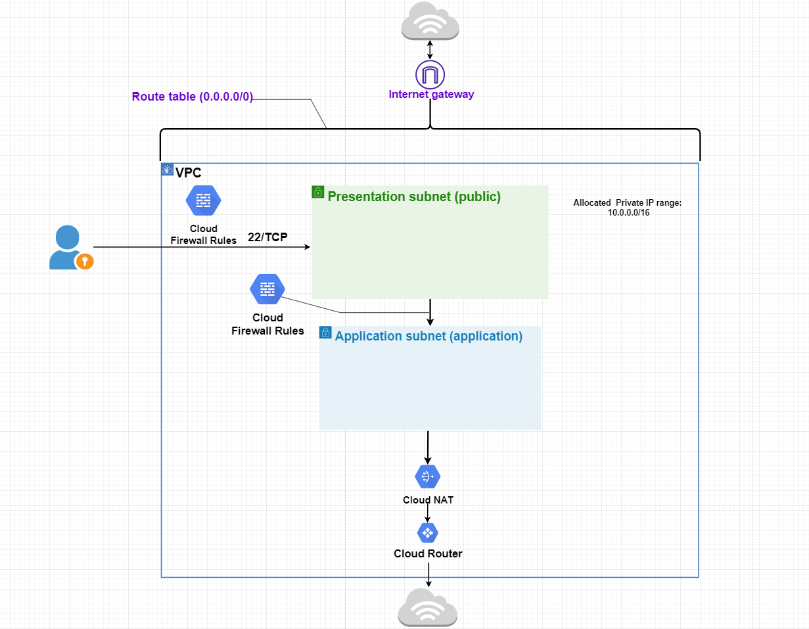
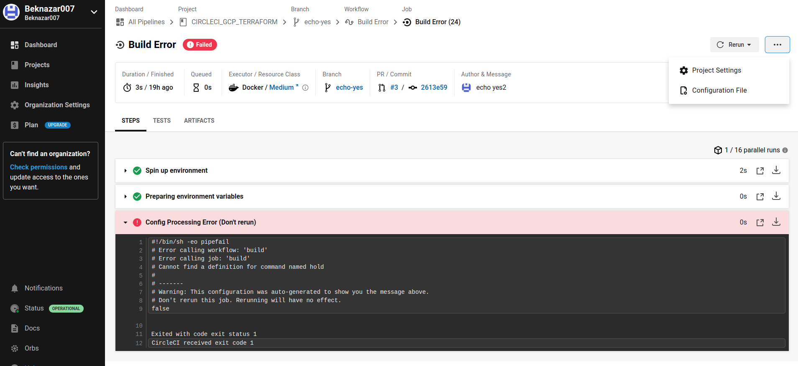
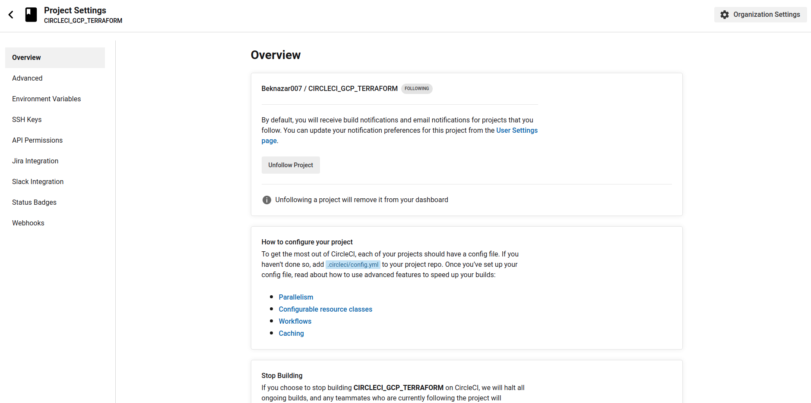
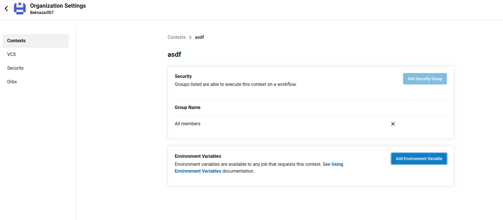
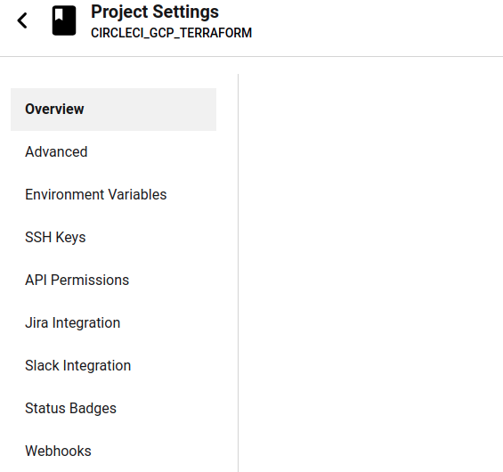
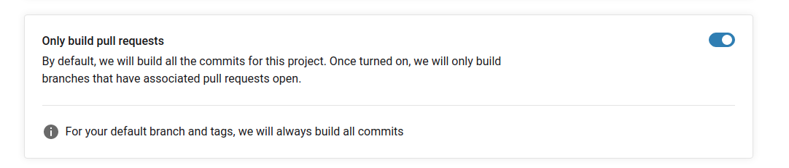
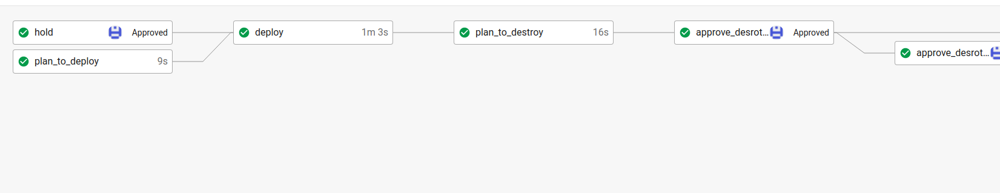
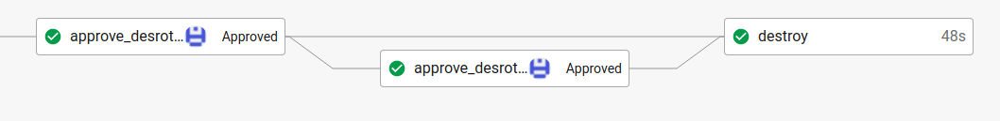

# Terraform GCP Network

## This codes create:

1. ### VPC with 3 Subnetwork:
    - _Presentation Subnetwork (public)_
    - _Application Subnetwork (private)_
    - _Database Subnetwork (private)_
2. ### Route to IGW (egress to internet from resource tagged ***"public"***)
3. ### Three Firewall Rules:
    - Public Subnet open to all externall traffic (for ***"public"*** tagged resource)
    - Application Subnet receive traffic from private IPs originating from the Public Subnet (to resource tagged ***"application"***)
    - Database Subnet receive traffic from private IPs originating from the Application Subnet (to resource tagged ***"database"***)
4. ### NAT-GW with Router

## **Diagram**


    
## **Usage**
```terraform
provider "google" {
  credentials = file(var.credentials_file_path)

  project = var.project_id
  region  = var.region
  zone    = var.main_zone
}

module "google_networks" {
  source = "./networks"

  nat_subnet_name = "application-subnet"

  #==========================SUBNETS=============================
  subnets = [
    {
      subnet_name     = "presentation-subnet"
      subnet_ip_range = var.presentation_ip_range
      subnet_region   = "us-central1"
    },
    {
      subnet_name           = "application-subnet"
      subnet_ip_range       = var.application_ip_range
      subnet_region         = "us-central1"
      subnet_private_access = true
    },
    {
      subnet_name           = "database-subnet"
      subnet_ip_range       = var.database_ip_range
      subnet_region         = "us-central1"
      subnet_private_access = true
    },

  ]


  #============================ROUTES=============================

  routes = [
    {
      name              = "igw-route"
      destination_range = var.igw_destination
      next_hop_internet = "true"
    },
  ]

  #=========================FIREWALL-RULES========================
  firewall_rules = [
    {
      name        = "presentation-firewall-rule"
      direction   = "INGRESS"
      ranges      = var.presentation_firewall_ranges
      target_tags = ["public"]
      source_tags = null

      allow = [{
        protocol = "tcp"
        ports    = ["22"]
      }]
      deny = []
    },
    {
      name        = "application-db-firewall-rule"
      direction   = "INGRESS"
      ranges      = var.application_firewall_ranges
      target_tags = ["application", "database"]
      source_tags = null

      allow = [{
        protocol = "all"
        ports    = null
      }]
      deny = []

    },
    {
      name        = "database-firewall-rule"
      direction   = "INGRESS"
      ranges      = var.database_firewall_ranges
      source_tags = null
      target_tags = ["database"]

      allow = [{
        protocol = "all"
        ports    = null
      }]
      deny = []
    }
  ]
}

```

Then perform the following commands on the root folder:
- `terraform init` terraofrm initialization
- `terraform plan` to see the infrastructure plan
- `terraform apply` to apply infastructure build
- `terraform destroy` to destroy the build infastructure

## **Inputs to variables.tf**
| Name | Description |  Type  |
| ---- | --------- | ------ | 
|project_id | Write to "default" the project name where the resource will created | `string`|
| credentials_file | Write to "default" the path to your credentials file | `string`|
|region | Write to "default" the region where by default your resource will created | `string`|
|zone | Write to "default" the zone where by default your resource will will created | `string`|


## **VPC Inputs**

| Name | Description |  Type  |
| ---- | --------- | ------ | 
| gcp_vpc_name | The name of created VPC | `string` |
|auto_create_subnetworks| It will create a subnet for each region automatically accross the CIDR-block range, if it is "true" | `bool` |
|routing_mode| The network routing mode | `string` |
|delete_default_routes_on_create | If set "true", default routes (0.0.0.0/0) will be deleted immediately after network creation. | `bool` |

## **Subnet Inputs**
| Name | Description |  Type  |
| ---- | --------- | ------ | 
| subnet_name | The name of the subnet being created | `string` |
| subnet_ip_range | The IP and CIDR range of the subnet being created | `string` |
| subnet_region | The region where the subnet will be created | `string` |
| subnet_private_access | Whether this subnet will have private Google access enabled | `string` |

## **Routes Inputs**
| Name | Description |  Type  |
| ---- | --------- | ------ | 
| name | The name of the route being created | `string`|
| tags | The network tags assigned to this route. This is a list in string format. Eg. "tag-01,tag-02" | `string` |
| destination_range |The destination range of outgoing packets that this route applies to. Only IPv4 is supported | `string` |
| next_hop_insternet | Whether the next hop to this route will the default internet gateway. Use "true" to enable this as next hop | `string` |
| next_hop_ip | Network IP address of an instance that sould handle matching packets | `string` |
| next_hop_instance | URL or name of an instance that should handle matching packets. If just name is specified "next_hop_instance_zone" is required | `string`|
| next_hop_instance_zone | The zone of the instance specified in next_hop_instance. Only required if next_hop_instance is specified as a name | `string` |
| next_hop_vpc_tunnel | URL to a VpnTunnel that should handle matching packets | `string` |
|priority | The priority of this route. Priority is used to break ties in cases where there is more than one matching route of equal prefix length. In the case of two routes with equal prefix length, the one with the lowest-numbered priority value wins | `string` |


## **Firewall Rules Inputs**
| Name | Description |  Type  |
| ---- | --------- | ------ | 
| name | The name of the firewall rule being created | `string` |
| direction | Direction of traffic to which this firewall applies; default is INGRESS. | `string` |
| ranges | `source_ranges` if direction is `INGRESS` and `destination_ranges` if direction is `EGRESS` | `list(string)` |
| source_tags | If source tags are specified, the firewall will apply only to traffic with source IP that belongs to a tag listed in source tags | `list(string)` |
| target_tags |  A list of instance tags indicating sets of instances located in the network that may make network connections as specified in allowed | `list(string)`
| allow | The list of ALLOW rules specified by this firewall. Each rule specifies a protocol and port-range tuple that describes a permitted connection | `list(object)` |
| deny | The list of DENY rules specified by this firewall | `list(object)` |
|protocol | The IP protocol to which this rule applies | `string` |
|ports | An optional list of ports to which this rule applies | `list(string)`


# CircleCI PART
1. Take Credentials file
2. Add to CircleCI Context
3. Create bucket in GCP
4. Go to the main.tf and specify your bucket name  
# GCP configuration 
>If you  have credentials file you can add to Context in CircleCI 
>In **IAM & ADMIN** click **Service Accounts** and add new account . configure there some parts and create new key which contains all credentials to log in .

# Cofigure In CIRCLECI

>we have to click three dotes and click **Project Settings**


>click **Organization Settings**


>Here click context , add  and create new variable. To the vars we have to put **GOOGLE_CREDENTIALS**  from credentials file which is in the **name_of_file_from_GCP.json**



>This is for giving **only pull request** to do it we have to click **Advanced** and there turn on next configuration



>After this configuration we have to change some of the file and and push to new branch and pull request new branch with master branch and then our code will work fully. 

 


# Adding CircleCI 

> I have added Circleci for this project with the same logic as Nurmukhammed does.
1. Adding credentials to the Circleci Context and take it from there.(this was Beki's GCP creds )

        
1. Creating Google storage for **.tfstate** file to safe our spin up info about terraform file

        terraform {
            backend "gcs" {
              bucket = "name_of_bucket"
              prefix = "terraform/"
            }  
1. In circleci we have to put context after workflow and than it will work.
        
        workflows: 
          build:
            jobs:
              - build:
                  context: GOOGLE_CREDENTIALS 
              - Attention When you will approve:
                  type: approval 
                  requires:
                    - build
              - build2:
                  context: GOOGLE_CREDENTIALS
                  requires: 
                    - Attention When you will approve.
                    - build
# Adding destroy part to the circleci
>1. Firstly we have to plan our **mian.tf** to know what kind of actions it will do. Job to plan this in CircleCI
        
        plan_to_deploy:
          working_directory: /terraform
          docker: 
            - image: hashicorp/terraform  
          steps:
            - checkout 
            - run:
                name: "init"
                command: terraform init
            - run:
                name: "plan"
                command: terraform plan   -input=false 

>2. Job to **deploy** to GCP

      deploy:
        working_directory: /terraform
        docker: 
          - image: hashicorp/terraform  

        steps:
          - checkout 
          - run:
              name: "init"
              command: terraform init

          - run:
              name: "apply"
              command: terraform apply --auto-approve 
            
>3. Job to  **plan to destroy** 

        plan_to_destroy:
          docker:
            - image: hashicorp/terraform:latest
          working_directory: /terraform
          steps:
            - checkout
            - run:
                name: Init
                command: terraform init -input=false
            - run:
                name: Plan
                command: terraform plan -destroy -input=false -out=tfplan -no-color
            - run:
                name: Render plan for PR comment
                command: terraform show -no-color tfplan > tfplan.txt
            - persist_to_workspace:
                root: /terraform
                paths:
                  - . 
>here we have to specify working directory **working_directory: /terraform/state** and persist our **tfplan** to the root: **/terraform/state**
>4. aplly destroy file

      destroy:
        docker:
          - image: hashicorp/terraform:latest
        working_directory: /terraform
        steps:
          - attach_workspace:
              at: /terraform
          - run:
              name: destroy
              command: terraform apply tfplan


            
>5. Workflow for project

    workflows:
      version: 2
      plan_pr:
        jobs:
          - plan_to_deploy:
              context: GOOGLE_CREDENTIALS 
          
          - hold:
              type:  approval
          
          - deploy:
              context: GOOGLE_CREDENTIALS 
              requires:
                - plan_to_deploy
                - hold
          
          - plan_to_destroy:
              context: GOOGLE_CREDENTIALS
              requires:
                - deploy
          
          - approve_to_destroy1:
              type:  approval
              requires:
                - plan_to_destroy
          - are_you_shure_to_destroy:
              type:  approval
              requires:
                - approve_to_destroy1
       
      
          - destroy:
              context: GOOGLE_CREDENTIALS 
              requires:
            
                - approve_to_destroy1
                - are_you_shure_to_destroy
>view from Cirlceci application

> If you want to destoy you have to approve 2 approval part and it will destroy                

